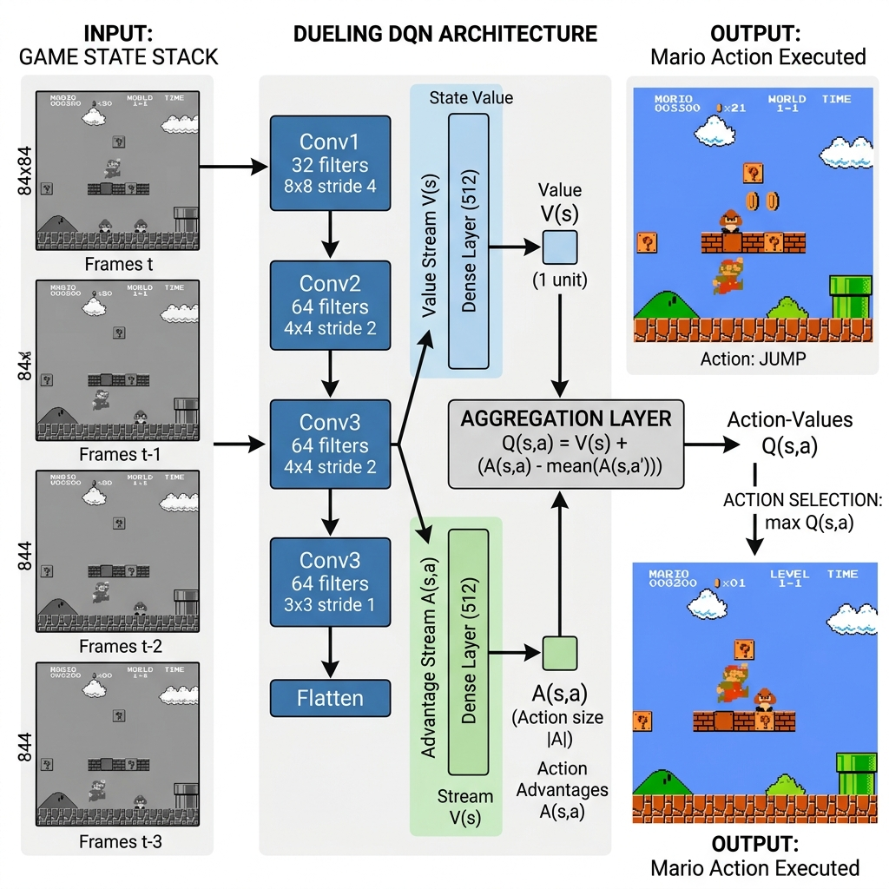
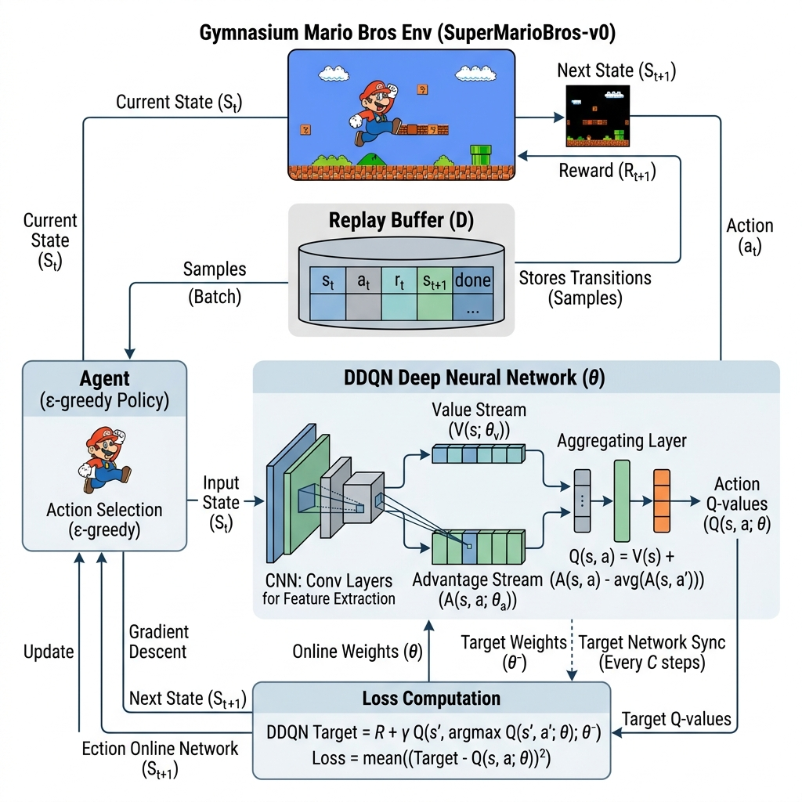

# Huấn luyện Tác tử chơi Super Mario Bros bằng thuật toán Dueling Double Deep Q-Network

Dự án này trình bày nghiên cứu và thực nghiệm về việc áp dụng học tăng cường sâu (Deep Reinforcement Learning) để tự động hóa hành vi của nhân vật Mario trong môi trường giả lập Super Mario Bros (Màn 1-1). Hệ thống sử dụng kiến trúc cải tiến Dueling Double Deep Q-Network (Dueling DDQN) được thiết kế tối ưu hóa tốc độ forward/backward trên CPU, giảm thiểu các lỗi ước lượng quá mức (overestimation bias) của thuật toán DQN truyền thống.



---

## Tóm tắt Nghiên cứu (Abstract)
Nghiên cứu này tập trung giải quyết bài toán điều khiển tự động trong trò chơi Super Mario Bros bằng cách chuyển đổi từ kiến trúc Deep Q-Network (DQN) tiêu chuẩn sang Dueling Double DQN (DDQN). Trong các thử nghiệm ban đầu với cấu trúc DQN cổ điển, tác tử (agent) được huấn luyện qua 100.000 episodes (tương đương 80,44 giờ tính toán) nhưng bị giới hạn hiệu năng ở mức điểm đánh giá thực tế là 2139.0 và không thể vượt qua màn chơi 1-1. Phân tích thực nghiệm chỉ ra hai nguyên nhân chính: hiện tượng quá ước lượng giá trị hành động (overestimation bias) và hệ số chiết khấu tương lai quá ngắn ($\gamma = 0.90$). Bằng việc nâng cấp lên kiến trúc Dueling để phân tách giá trị trạng thái và lợi thế hành động, kết hợp với cơ chế Double Q-learning và điều chỉnh $\gamma = 0.99$, mô hình mới giúp ổn định hóa quá trình học và tăng khả năng hoạch định dài hạn cho tác tử.

---

## 1. Đặt vấn đề và Mục tiêu (Introduction)
Super Mario Bros là một trò chơi đi ngang (side-scrolling platformer) có không gian trạng thái lớn và các phần thưởng thưa thớt (sparse rewards). Tác tử phải học cách phối hợp các tổ hợp phím nhảy, chạy nhanh và tránh chướng ngại vật (như hố sâu, quái vật, ống nước) để đạt mục tiêu cuối cùng là cột cờ ở cuối bản đồ. 

Các mô hình DQN cổ điển thường gặp khó khăn trong việc duy trì sự ổn định khi ước lượng giá trị Q-value cho các hành động tương tự nhau trong cùng một trạng thái. Nghiên cứu này hướng tới mục tiêu xây dựng một cấu trúc mạng nơ-ron tích chập (CNN) kết hợp Dueling và Double DQN, giúp tác tử tự học các hành vi di chuyển phức tạp và hoàn thành màn 1-1 mà không yêu cầu tài nguyên phần cứng GPU chuyên dụng.

---

## 2. Phương pháp luận và Kiến trúc Hệ thống (Methodology & Architecture)

Hệ thống được thiết kế theo mô hình tương tác vòng lặp kín giữa Tác tử (Agent) và Môi trường giả lập (Environment) thông qua bốn thành phần cốt lõi:



### Tiền xử lý môi trường (Environment Wrappers)
Hình ảnh gốc từ game được giảm chiều dữ liệu để giảm tải tính toán cho bộ xử lý (CPU) qua 5 bước lọc:
1.  **JoypadSpace:** Giới hạn không gian hành động từ vô số tổ hợp nút bấm về 7 hành động cơ bản (SIMPLE_MOVEMENT).
2.  **SkipFrame:** Bỏ qua 4 khung hình liên tiếp và cộng dồn phần thưởng, giúp tăng tốc độ phản hồi và giảm số bước tính toán.
3.  **GrayScaleObservation:** Chuyển đổi ảnh màu RGB thành ảnh xám (Grayscale), giảm 2/3 lượng bộ nhớ đầu vào.
4.  **ResizeObservation:** Thu nhỏ kích thước ảnh từ độ phân giải gốc về kích thước 84x84 pixel.
5.  **FrameStack:** Gộp 4 khung hình xám liên tiếp thành một trạng thái đầu vào có kích thước (4, 84, 84), cung cấp thông tin về vận tốc và hướng di chuyển của Mario.

### Các mô hình mạng Neural tích chập và Thuật toán (Models & Algorithms)

Nghiên cứu này tiến hành so sánh hai kiến trúc mạng nơ-ron sâu được thiết kế để xấp xỉ hàm giá trị $Q(s, a)$ trong học tăng cường, được triển khai chi tiết trong [model.py](src/model.py) và [agent.py](src/agent.py).

**1. Vanilla Deep Q-Network (`MarioNet`)**
Mạng Deep Q-Network (DQN) tiêu chuẩn (Mnih et al., 2015) sử dụng một chuỗi các lớp tích chập (Convolutional Neural Networks - CNNs) để trích xuất đặc trưng không gian từ ảnh đầu vào. Sau đó, một lớp kết nối đầy đủ (Fully Connected) duy nhất được sử dụng để ánh xạ các đặc trưng này trực tiếp thành giá trị Q-value dự đoán cho từng hành động khả thi:
$$Q(s, a; \theta) \approx Q^*(s, a)$$
*Hạn chế:* Cấu trúc này thường gặp phải hiện tượng đánh giá quá mức (overestimation bias) giá trị của các hành động do tính chất cập nhật hàm mục tiêu luôn dựa trên giá trị cực đại.

**2. Dueling Double Deep Q-Network (`MarioDuelingNet`)**
Để khắc phục điểm yếu của Vanilla DQN, kiến trúc Dueling DQN (Wang et al., 2016) được thiết kế để phân tách quá trình xấp xỉ giá trị thành hai luồng (streams) riêng biệt sau khi đi qua các lớp tích chập:
*   *Luồng State Value $V(s; \theta, \alpha)$:* Ước lượng giá trị nội tại của trạng thái hiện tại, thể hiện mức độ "tốt" của trạng thái đó một cách tổng quát.
*   *Luồng Action Advantage $A(s, a; \theta, \beta)$:* Ước lượng lợi thế tương đối của từng hành động so với các hành động khác tại trạng thái đó.

Giá trị Q-value tổng hợp cuối cùng được tính toán thông qua một module kết hợp đặc biệt nhằm đảm bảo tính định danh (identifiability) cho hệ thống, gia tăng độ ổn định của quá trình huấn luyện:
$$Q(s, a; \theta, \alpha, \beta) = V(s; \theta, \alpha) + \left(A(s, a; \theta, \beta) - \frac{1}{|\mathcal{A}|} \sum_{a'} A(s, a'; \theta, \beta)\right)$$
*Ưu điểm:* Việc phân tách này giúp tác tử học được giá trị trạng thái một cách hiệu quả hơn ngay cả khi hành động không ảnh hưởng nhiều đến diễn biến tiếp theo của môi trường.

**Kết hợp với Thuật toán Double Q-Learning**
Hệ thống cũng áp dụng đồng thời cơ chế Double Q-Learning (van Hasselt et al., 2016) để loại bỏ triệt để vấn đề đánh giá quá mức (overestimation). Quá trình chọn hành động tối ưu được thực hiện bởi mạng Online, trong khi giá trị của hành động đó được đánh giá bởi mạng Target (được cập nhật chậm định kỳ):
$$Y_t^{DoubleDQN} = R_{t+1} + \gamma Q_{target}\left(S_{t+1}, \arg\max_a Q_{online}(S_{t+1}, a; \theta_t); \theta_t^-\right)$$

---

## 3. Thống kê kết quả huấn luyện (Experimental Results)

### Chỉ số hiệu năng của mô hình DQN cũ
Các số liệu thực tế được trích xuất từ tập tin nhật ký huấn luyện [training_log.csv](training_log.csv) trong 100.000 episodes đầu tiên được thể hiện chi tiết ở bảng dưới đây:

| Chỉ số hiệu năng huấn luyện | Giá trị thực nghiệm |
| :--- | :--- |
| Tổng số episodes dữ liệu | 100.000 |
| Tổng thời gian huấn luyện tích lũy trên CPU | 289.584,12 giây (khoảng 80,44 giờ) |
| Điểm phần thưởng cao nhất ghi nhận (Max Reward) | 3069.0 |
| Điểm đánh giá chơi thực tế trung bình (play.py) | 2139.0 |
| Trạng thái hoàn thành màn chơi 1-1 | Chưa hoàn thành (bị kẹt tại ống nước hoặc rơi xuống hố) |
| Tên mô hình tương ứng | VanillaDQN |

### So sánh cấu hình thuật toán và siêu tham số (Hyperparameters)
Để khắc phục các hạn chế về mặt thuật toán và khả năng học của tác tử, hệ thống đã được cấu hình lại toàn bộ các tham số huấn luyện cốt lõi:

| Thành phần & Siêu tham số | Cấu hình cũ (DQN) | Cấu hình mới (Dueling DDQN) |
| :--- | :--- | :--- |
| **Thuật toán cốt lõi** | Vanilla Deep Q-Network | Double Deep Q-Network (DDQN) |
| **Mạng Neural tích hợp** | `MarioNet` (Một luồng ước lượng) | `MarioDuelingNet` (Hai luồng song song) |
| **Hệ số chiết khấu tương lai ($\gamma$)** | 0.90 (tầm nhìn ngắn hạn, ~10 bước) | 0.99 (tầm nhìn dài hạn, định hướng cột cờ) |
| **Dung lượng bộ nhớ Replay Buffer** | 30.000 transitions | 100.000 transitions (tránh hiện tượng quên nhanh) |
| **Kích thước mẫu học (Batch Size)** | 32 | 64 (ổn định hóa cập nhật gradient) |
| **Hệ số giảm khám phá (`epsilon_decay`)**| 0.999999 (giảm quá chậm) | 0.9999962 (hội tụ về mức tối thiểu 0.05 tại ~800k steps tổng) |

### Phân tích nguyên nhân và hướng khắc phục
Kết quả thực nghiệm cho thấy mô hình DQN ban đầu không thể giúp nhân vật Mario vượt qua màn chơi 1-1 do hệ số chiết khấu $\gamma$ quá thấp. Với thiết lập cũ, tác tử chỉ tối ưu hóa các phần thưởng đạt được trong khoảng 10 bước di chuyển tiếp theo, dẫn đến việc không thể phát hiện các mối nguy hiểm lớn hoặc xây dựng chiến lược nhảy qua các hố sâu phức tạp ở giữa bản đồ. Ngoài ra, việc giảm epsilon quá chậm làm tăng tỷ lệ hành động ngẫu nhiên không cần thiết ở giai đoạn sau của quá trình huấn luyện, làm loãng các chính sách di chuyển đúng đắn đã học được. 

Việc chuyển đổi sang kiến trúc Dueling Double DQN với các tham số điều chỉnh như trên giúp ổn định hàm mất mát (loss function), loại bỏ hiện tượng quá ước lượng Q-value và cho phép tác tử tập trung khai thác các chuỗi hành động di chuyển tối ưu để hoàn thành màn chơi một cách nhất quán.

---

## 4. Yêu cầu Cài đặt (Setup)

Dự án yêu cầu cài đặt môi trường Python 3.12+ (đã được cấu hình sẵn trong môi trường ảo `.venv` tại thư mục gốc).

Để tự cài đặt các thư viện phụ thuộc:
```bash
pip install -r requirements.txt
```

---

## 5. Hướng dẫn Vận hành và Chuyển đổi Mô hình (Usage)

### Chuyển đổi giữa hai cấu trúc mô hình
Hệ thống cho phép người dùng chuyển đổi linh hoạt giữa hai kiến trúc **Vanilla DQN** và **Dueling DDQN** bằng cách thay đổi tham số `model_type` khi khởi tạo tác tử `MarioDQN` trong các tệp mã nguồn chính như `main.py` và `play.py`:

- **Sử dụng Dueling DDQN (Khuyến nghị):**
  ```python
  agent = MarioDQN(state_dim, action_dim, save_dir="checkpoints", model_type="dueling")
  ```
- **Sử dụng Vanilla DQN (Sử dụng để so sánh/benchmark):**
  ```python
  agent = MarioDQN(state_dim, action_dim, save_dir="checkpoints", model_type="vanilla")
  ```

> [!WARNING]
> Bạn phải đảm bảo thiết lập tham số `model_type` đồng nhất giữa quá trình huấn luyện (`main.py`) và quá trình chạy đánh giá trực quan (`play.py`). Việc dùng tham số này mở file lưu weights khác biệt và định nghĩa cấu trúc Model khác nhau.

### Kích hoạt môi trường
Kích hoạt môi trường ảo trước khi thực hiện các lệnh chạy (đối với PowerShell trên Windows):
```powershell
# Kích hoạt môi trường ảo
.\.venv\Scripts\Activate.ps1
```

### Huấn luyện mô hình
Chạy tập tin chính để khởi động tiến trình huấn luyện đa luồng (sử dụng AsyncVectorEnv với 8 workers chạy song song nhằm tối ưu hóa CPU đa nhân):
```bash
python main.py
```
*   Nhật ký huấn luyện sẽ được lưu trữ tự động vào tập tin `training_log.csv`, tự động bổ sung tên model tương ứng ở cột `"Model"`.
*   Trọng số của mô hình được tự động lưu trữ định kỳ tại thư mục `checkpoints/`.

### Đánh giá và Chạy thử trực quan
Để chạy kiểm thử trực quan hành vi điều khiển của Mario trên màn hình game (chế độ render 'human' và tắt hoàn toàn hành động ngẫu nhiên):
```bash
python play.py
```
*   Hệ thống sẽ tự động tìm kiếm và tải trọng số tốt nhất `mario_dqn_best.pt`.
*   Nếu trọng số không khớp kiến trúc mạng mới (ví dụ trọng số cũ của Single DQN), Agent sẽ in thông báo cảnh báo và tự động chuyển sang điều khiển ngẫu nhiên để tránh crash hệ thống.

---

## Tài liệu Tham khảo (References)

1. Mnih, V., Kavukcuoglu, K., Silver, D., Rusu, A. A., Veness, J., Bellemare, M. G., ... & Hassabis, D. (2015). Human-level control through deep reinforcement learning. *Nature*, 518(7540), 529-533.
2. van Hasselt, H., Guez, A., & Silver, D. (2016). Deep reinforcement learning with double q-learning. In *Proceedings of the AAAI Conference on Artificial Intelligence* (Vol. 30, No. 1).
3. Wang, Z., Schaul, T., Hessel, M., Hasselt, H., Lanctot, M., & Freitas, N. (2016). Dueling network architectures for deep reinforcement learning. In *International conference on machine learning* (pp. 1995-2003). PMLR.
